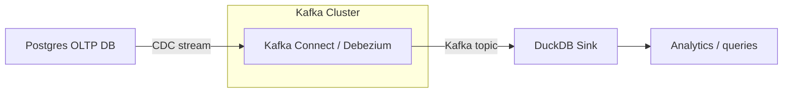

This project demonstrates a production-inspired Change Data Capture (CDC) pipeline, designed to reflect real-world data engineering practices with constant data evolution. Inspired by the Real-time Data Streaming Pipelines in Kredivo Group, this project focus on scalability and high-reproducability architecture to support company's massive and continuously growing data platform.

The scope of this project is to captures changes from a transactional Postgres database using Debezium, streams them through Kafka, and materializes them into an analytical store (DuckDB) via a custom Python sink.

# CDC Pipeline: Postgres → Kafka → DuckDB

[](https://www.python.org/)
[](https://www.docker.com/)
[](LICENSE)

Design Flow:
- Capturing Postgres changes via **Debezium / Kafka Connect**
- Streaming changes into **Kafka topics**
- Consuming and storing them into **DuckDB** for analytics  
- Fully containerized using **Docker Compose**

## Architecture



## Folder Structure
```
cdc_pipeline/
├── docker-compose.yml
├── .env.example
├── .credentials.example
├── README.md
├── requirements.txt
├── connectors/
│   ├── connector_template.json
│   ├── connector_config.json
│   └── generate_connectors.py
├── src/
│   ├── consumer/
│   │   ├── __init__.py
│   │   ├── duckdb_sink.py
│   │   └── config.py
│   └── utils/
│       ├── __init__.py
│       ├── db_utils.py
│       └── logger.py
├── data/
└── infra/
```

## Setup & Deployment
### Prerequisites
Ensure you have:
- Docker 24 or above
- Docker Compose v2
- Python 3.10 or above (for connector generation only)
- `curl`

Verify by running these commands in your terminal:
```
docker --version
docker compose version
python --version
```

### 1. Clone the repository
```
git clone git@github.com:celestiasol/cdc_pipeline.git
cd cdc_pipeline
```

### 2. Create your .credentials file
Create a `.credentials` file to store DB secrets such as username, password and database name. This information should be kept separate for clear project boundary and security reasons. You can do this by renaming `.credentials.example` to `.credentials` or just run the code below in your terminal then change the content values according to your configurations.
```
cp .credentials.example .credentials
# Edit .credentials with your Postgres username/password/database
```

### 3. Configure .env file
Create a `.env` file (non-secret) to store ports, versions and infra variables. You can do this by renaming `.env.example` to `.env` and change the variables according to your configurations. Example `.env` file configuration values:
```
# Project
PROJECT_NAME=cdc_pipeline

# Zookeeper
ZOOKEEPER_VERSION=3.9.4
ZOOKEEPER_PORT=2181

# Kafka
KAFKA_VERSION=7.5.0
KAFKA_EXTERNAL_PORT=29092
DUCKDB_PATH=cdc_pipeline.duckdb
TOPIC_PREFIX=dbserver1

# Postgres
POSTGRES_VERSION=15
POSTGRES_PORT=5432

# Debezium / Kafka Connect
DEBEZIUM_VERSION=2.6
KAFKA_CONNECT_PORT=8083
CONNECT_GROUP_ID=cdc-connect-group
CONNECT_CONFIG_TOPIC=cdc_connect_configs
CONNECT_OFFSET_TOPIC=cdc_connect_offsets
CONNECT_STATUS_TOPIC=cdc_connect_status
```

### 4. Start the platform
For this pipeline, the sink is fully containerized, to build the image, run:
```
docker compose build duckdb-sink
```
Then bring up all the run time services and inject the `.env` and `.credentials` so docker could access the variables.
```
docker compose --env-file .env --env-file .credentials up -d
```
Verify by running:
```
docker ps
```
and you should see:
- cdc_pipeline_zookeeper
- cdc_pipeline_kafka
- cdc_pipeline_postgres
- cdc_pipeline_kafka_connect
- cdc_pipeline_duckdb_sink
  
### 5. Generate Debezium connector configs
This step is run locally, not in Docker.

5.1. Install dependencies
```
pip install -r requirements.txt
```

5.2. Generate connector JSON files
```
python connectors/generate_connectors.py
```

This reads connector_config.json and outputs a JSON file called `postgres-cdc-connector.json` with Debezium connector configurations that has the tables and schema we wish to replicate. To modify the tables and schema, you can edit `connector-config.json` file. The tables and schema configurations are separated to achieve better scalability and easier code maintainability.

### 6. Register Debezium Connector into Kafka Connect
Register each connector:
```
curl -X POST http://localhost:8083/connectors \
     -H "Content-Type: application/json" \
     -d @connectors/postgres-cdc-connector.json
```
Verify the connector is successfully deployed:
```
curl http://localhost:8083/connectors | jq
```

### 7. Monitor the pipelines

7.1. Verify Kafka topic exist:
```
docker exec -it cdc_pipeline_kafka kafka-topics \
  --bootstrap-server kafka:9092 \
  --list
```

7.2. You should see topics similar to:
```
dbserver1.public.users
dbserver1.public.orders
```

7.3. Verify Debezium Connectors status are RUNNING
```
curl http://localhost:8083/connectors/cdc_db_connector/status
```

### 8. Set up Postgres DB
Before we insert any data, we have to create new tables in our database. You can do this by manually entering the postgresql container and perform DDL and DML in there by running SQL commands, or you can run
```
docker exec -i cdc_pipeline_postgres psql -U ${your_postgres_user} -d ${your_postgres_db} < data/init_data.sql
```
to execute the script supplemented in this repo for tables creation and sample data insertion, you can also edit the script before running it, if you want to use your own table structures and sample data.

### 9. Access pipeline logs to verify the changes has been recorded
After creating the tables and inserting sample data, we should be able to see them in our Kafka Topic, to do this we can run:
```
docker exec -it cdc_pipeline_kafka \
  kafka-console-consumer --bootstrap-server kafka:9092 \
  --topic dbserver1.public.users --from-beginning
```
Additionally, we can also view our sink container logs to ensure the data has been inserted to DuckDB.
```
docker logs -f cdc_pipeline_duckdb_sink
```
and we should see messages such as:
```
2026-01-04 14:15:29,140 [INFO] duckdb_sink: Upserted row into public_users: {'id': 1, 'name': 'Alice', 'email': 'alice@example.com', 'updated_at': 1767536128661615}
2026-01-04 14:15:29,148 [INFO] duckdb_sink: Upserted row into public_orders: {'id': 1, 'user_id': 1, 'amount': 'LxI=', 'status': 'completed', 'updated_at': 1767536128662354}
2026-01-04 14:15:29,154 [INFO] duckdb_sink: Upserted row into public_orders: {'id': 2, 'user_id': 2, 'amount': 'HUw=', 'status': 'pending', 'updated_at': 1767536128662354}
2026-01-04 14:15:29,158 [INFO] duckdb_sink: Upserted row into public_orders: {'id': 3, 'user_id': 3, 'amount': 'Yag=', 'status': 'completed', 'updated_at': 1767536128662354}
2026-01-04 14:15:29,161 [INFO] duckdb_sink: Upserted row into public_users: {'id': 2, 'name': 'Bob', 'email': 'bob@example.com', 'updated_at': 1767536128661615}
2026-01-04 14:15:29,165 [INFO] duckdb_sink: Upserted row into public_users: {'id': 3, 'name': 'Charlie', 'email': 'charlie@example.com', 'updated_at': 1767536128661615}
```

If you want, we can verify the real-time streaming performance of the pipelines by inserting a new data such as:
```
INSERT INTO users (id, name, email, updated_at)
VALUES (4, 'David', 'david@example.com', NOW());
```
or we can also verify by performing other operations such as:
```
UPDATE users SET name = 'Alice Updated' WHERE id = 1;
DELETE FROM orders WHERE id = 1;
```
and witness in our Kafka Topic logs and our sink logs that a new row has been processed (in Kafka Topic it would look like a JSON).

### 10. Verify the data in DuckDB
DuckDB does not allow multiple connections to the same database file concurrently. Your sink process already has an open connection (duckdb_sink.py running in the container), so any other connection, even in read-only mode, will fail with that _duckdb.IOException: Could not set lock error.

This is expected behavior — it’s not a bug. DuckDB is designed as an embedded single-writer database, so you can’t “peek in” while another process is writing.

To ensure all pipelines are running smoothly without errors or mistakes, we have to verify that the data in our destination table should match the data in the source database. However, because DuckDB is designed as an embedded single-writer database, so we can’t “peek in” while another process is writing. DuckDB does not allow multiple connections to the same database file concurrently. Our sink process already has an open connection (duckdb_sink.py running in the container), so any other connection, even in read-only mode, will fail with `_duckdb.IOException: Could not set lock error`. But, we can copy the DuckDB file out of the container, make a temporary copy of the database and inspect it:
```
docker cp cdc_pipeline_duckdb_sink:/data/cdc_pipeline.duckdb ./
docker cp cdc_pipeline_duckdb_sink:/data/cdc_pipeline.duckdb.wal ./
```
This method is safe and non-disruptive, and we can inspect it locally with duckdb CLI:
```
duckdb ./cdc_pipeline.duckdb
```
Then once inside the CLI, we can run commands as such to verify the data:
```
.tables
SELECT * FROM users LIMIT 10;
.exit
```

### Lifecycle Operations
Restart everything:
```
docker compose restart
```
Stop everything:
```
docker compose down
```
Full reset (you need to reconfigure all the changes you made in the containers):
```
docker compose down -v
```

### Additional Notes

- To enable real-time replication in Postgres, we need to ensure WAL is set to `logical`. In this pipeline, we run `infra/init_postgres.sql` as initialization script in the `postgres` container so it is automatically done each time we do a full reset.
- Each Debezium connector corresponds to one schema (can handle multiple tables).
- Each table can have a dedicated sink for flexibility and schema evolution.
- DuckDB is used for local development and testing; you can replace it with BigQuery or any warehouse for production.
- Environment variables and credentials are separated for security and reproducibility.


