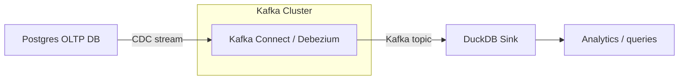

This project demonstrates a production-inspired Change Data Capture (CDC) pipeline, designed to reflect real-world data engineering practices with constant data evolution. Inspired by the Real-time Data Streaming Pipelines in Kredivo Group, this project focus on scalability and high-reproducability architecture to support company's massive and continuously growing data platform.

The scope of this project is to captures changes from a transactional Postgres database using Debezium, streams them through Kafka, and materializes them into an analytical store (DuckDB) via a custom Python sink.

# CDC Pipeline: Postgres → Kafka → DuckDB

[](https://www.python.org/)
[](https://www.docker.com/)
[](LICENSE)

Design Flow:
- Capturing Postgres changes via **Debezium / Kafka Connect**
- Streaming changes into **Kafka topics**
- Consuming and storing them into **DuckDB** for analytics  
- Fully containerized using **Docker Compose**

## Architecture



## Folder Structure
```
cdc_pipeline/
├── docker-compose.yml
├── .env
├── .credentials.example
├── README.md
├── requirements.txt
├── connectors/
│   ├── connector_template.json
│   ├── connector_config.json
│   └── generate_connectors.py
├── src/
│   ├── consumer/
│   │   ├── __init__.py
│   │   ├── duckdb_sink.py
│   │   └── config.py
│   └── utils/
│       ├── __init__.py
│       ├── db_utils.py
│       └── logger.py
├── data/
└── infra/
```

## Setup & Deployment
### Prerequisites
Ensure you have:
- Docker 24 or above
- Docker Compose v2
- Python 3.10 or above (for connector generation only)
- `curl`

Verify by running these commands in your terminal:
```
docker --version
docker compose version
python --version
```

### 1. Clone the repository
```
git clone git@github.com:yourusername/cdc_pipeline.git
cd cdc_pipeline
```

### 2. Create your .credentials file
Create a `.credentials` file to store DB secrets such as username, password and database name. This information should be kept separate for clear project boundary and security reasons. You can do this by renaming `.credentials.example` to `.credentials` or just run the code below in your terminal then change the content values according to your configurations.
```
cp .credentials.example .credentials
# Edit .credentials with your Postgres username/password/database
```

### 3. Configure .env file
Create a `.env` file (non-secret) to store ports, versions and infra variables. You can do this by renaming `.env.example` to `.env` and change the variables according to your configurations. Example `.env` file configuration values:
```
# Project
PROJECT_NAME=cdc_pipeline

# Zookeeper
ZOOKEEPER_VERSION=3.9.4
ZOOKEEPER_PORT=2181

# Kafka
KAFKA_VERSION=7.5.0
KAFKA_EXTERNAL_PORT=29092
DUCKDB_PATH=cdc_pipeline.duckdb
TOPIC_PREFIX=dbserver1

# Postgres
POSTGRES_VERSION=15
POSTGRES_PORT=5432

# Debezium / Kafka Connect
DEBEZIUM_VERSION=2.6
KAFKA_CONNECT_PORT=8083
CONNECT_GROUP_ID=cdc-connect-group
CONNECT_CONFIG_TOPIC=cdc_connect_configs
CONNECT_OFFSET_TOPIC=cdc_connect_offsets
CONNECT_STATUS_TOPIC=cdc_connect_status
```

### 4. Start the platform
For this pipeline, the sink is fully containerized, to build the image, run:
```
docker compose build duckdb-sink
```
Then bring up all the run time services and inject the `.env` and `.credentials` so docker could access the variables.
```
docker compose --env-file .env --env-file .credentials up -d
```
Verify by running:
```
docker ps
```
and you should see:
- cdc_pipeline_zookeeper
- cdc_pipeline kafka
- cdc_pipeline_postgres
- cdc_pipeline_kafka_connect
- cdc_pipeline_dickdb_sink
  
### 5. Generate Debezium connector configs
This step is run locally, not in Docker.

5.1. Install dependencies
```
pip install -r requirements.txt
```

5.2. Generate connector JSON files
```
python connectors/generate_connectors.py
```

This reads connector_config.json and outputs a JSON file with Debezium connector configurations.

### 6. Register Debezium Connector into Kafka Connect
Register each connector:
```
curl -X POST http://localhost:8083/connectors \
     -H "Content-Type: application/json" \
     -d @connectors/public-users-connector.json
```
Verify the connector is successfully deployed:
```
curl http://localhost:8083/connectors | jq
```

### 7. Monitor the pipelines

7.1. Verify Kafka topic exist:
```
docker exec -it cdc_pipeline_kafka kafka-topics \
  --bootstrap-server kafka:9092 \
  --list
```

7.2. You should see topics like:
```
dbserver1.public.users
dbserver1.public.orders
```

### 8. Insert test rows into Postgres
```
INSERT INTO users (id, name, email, updated_at)
VALUES (1, 'Alice', 'alice@example.com', NOW());
```

### Additional Notes

- Each Debezium connector corresponds to one schema (can handle multiple tables).
- Each table can have a dedicated sink for flexibility and schema evolution.
- DuckDB is used for local development and testing; you can replace it with BigQuery or any warehouse for production.
- Environment variables and credentials are separated for security and reproducibility.
